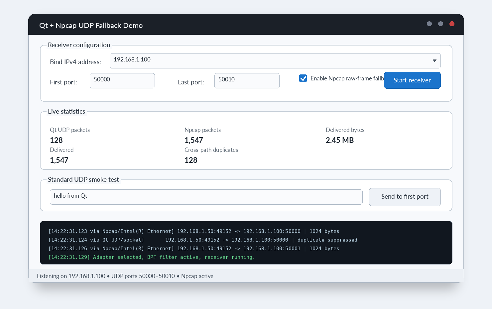

# Qt Npcap UDP Fallback

[](https://www.qt.io/)
[](https://isocpp.org/)
[](#requirements)
[](LICENSE)

A Qt 6 and C++ UDP packet receiver for Windows that combines `QUdpSocket` with an Npcap raw Ethernet capture fallback.

It is designed for cases where Windows drops valid UDP frames before they reach `QUdpSocket`, for example because of an incorrect or stale destination MAC address. Npcap captures the raw Ethernet frame in parallel and delivers the UDP payload to the application even when the normal Windows socket path rejects it.

> This repository is a generic reference implementation. It contains no hardware-specific protocol, production addresses, calibration data, packet IDs, or private application logic.

## Interface preview



> The image above is an illustrative preview generated from the current Qt Widgets layout. Replace it with a real Windows runtime screenshot after the first verified Npcap build.

## What it demonstrates

- Normal UDP reception through `QUdpSocket`
- Runtime loading of `wpcap.dll` with no Npcap SDK build dependency
- Automatic adapter discovery using the selected local IPv4 address
- BPF filtering by destination IPv4 address and UDP port range
- Ethernet, stacked VLAN/QinQ, raw IPv4, and `DLT_NULL` parsing
- Cross-path duplicate suppression when Qt and Npcap receive the same datagram
- Graceful standard-UDP-only operation when Npcap is unavailable
- A Qt Widgets dashboard with packet counters and a live packet log
- Unit tests for the raw IPv4/UDP parser

## Use cases

- FPGA and embedded-device data acquisition
- Industrial Ethernet monitoring
- UDP troubleshooting on Windows
- Recovering frames rejected before `QUdpSocket`
- Qt-based packet capture and diagnostic applications
- Laboratory instruments and high-rate telemetry receivers

## Architecture

```text
                           +-----------------------+
Device --> Ethernet/NIC -->| Windows network stack |--> QUdpSocket ----+
          |                +-----------------------+                   |
          |                                                            v
          +--> Npcap promiscuous capture --> frame parser --> deduplicator --> application
```

Npcap runs in parallel rather than waiting for a socket failure. This matters because a frame rejected at Ethernet layer 2 may never produce an error that the application can detect through `QUdpSocket`.

## Requirements

- Qt 6.4 or newer with the Widgets and Network modules
- CMake 3.21 or newer
- A C++17 compiler
- Windows for the Npcap raw-frame path
- Npcap installed on the target machine; Wireshark installations commonly include it

The project also builds on Linux and macOS, but it operates in `QUdpSocket`-only mode on those platforms.

## Build with Qt Creator

1. Open `CMakeLists.txt` in Qt Creator.
2. Select a Qt 6 desktop kit.
3. Configure and build the project.
4. Run `qt-npcap-udp-fallback`.
5. On Windows, confirm that Npcap is installed before testing raw-frame reception.

## Build from a terminal

```bash
cmake -S . -B build -DCMAKE_BUILD_TYPE=Release
cmake --build build --config Release
ctest --test-dir build -C Release --output-on-failure
```

On Windows, run the produced executable from the Release output directory. Npcap must be installed on the target computer because `wpcap.dll` is loaded at runtime.

## Usage

1. Select the local IPv4 address of the adapter connected to the sender. `0.0.0.0` scans all non-loopback IPv4 adapters.
2. Enter a destination UDP port or a port range.
3. Keep **Enable Npcap raw-frame fallback** selected.
4. Start the receiver.
5. Use **Send to first port** for a basic `QUdpSocket` smoke test.
6. Connect the real device to test the raw-frame fallback path.

## How the fallback helps

A normal UDP application only sees packets accepted by the operating system network stack. When the destination MAC address is stale or incorrect, Windows may discard the Ethernet frame before IP and UDP processing. Npcap can capture the raw frame from the network adapter, after which this project parses the IPv4 and UDP headers and forwards the payload through the same application-level callback used by `QUdpSocket`.

## Important limitations

- The parser currently accepts IPv4/UDP only.
- Fragmented IPv4 datagrams are intentionally rejected.
- Npcap can expose rejected frames only when the network adapter and driver provide them in promiscuous mode.
- Some systems require elevated privileges or an Npcap installation configured for non-admin capture.
- The demo opens one `QUdpSocket` per port and limits a configured range to 256 ports.
- The duplicate window is intentionally short and suppresses only packets seen through both receive paths.

## Troubleshooting

### Npcap is not detected

Install Npcap and confirm that `wpcap.dll` is available on the machine. Restart the application after installation.

### Standard UDP works but raw capture does not

Check the selected network adapter, run the application with sufficient privileges, and verify that the adapter supports promiscuous capture.

### The same packet appears twice

The receiver includes cross-path duplicate suppression. If duplicates remain, capture logs from both paths and review the configured duplicate window.

## Why `wpcap.dll` is not included

Npcap has separate distribution and licensing terms. This repository dynamically loads an existing local Npcap installation and does not redistribute Npcap binaries.

## Release

The first public release is documented in [`RELEASE_NOTES_v1.0.0.md`](RELEASE_NOTES_v1.0.0.md).

## Repository topics

Suggested GitHub topics:

`qt` `qt6` `cpp` `udp` `npcap` `pcap` `qudpsocket` `packet-capture` `networking` `ethernet` `windows` `cmake` `ipv4` `vlan` `data-acquisition`

## License

The source code in this repository is available under the [MIT License](LICENSE). Npcap itself is a separate third-party product and is not covered by this repository's license.
