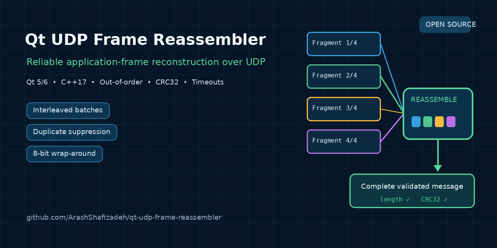

# Qt UDP Frame Reassembler



A reusable Qt 5/6 and C++17 component for reconstructing application-level messages that have been split across multiple UDP datagrams.

It supports out-of-order delivery, interleaved batches, duplicate suppression, timeout cleanup, missing-batch detection, CRC32 validation, and unsigned 8-bit batch wrap-around. The repository also includes a Qt Widgets simulator that sends real UDP traffic over localhost so each edge case can be reproduced with one click.

> This public project uses a generic demonstration packet format. It contains no private FPGA protocol, production address, packet identifier, calibration value, or company-specific logic.

## What problem does it solve?

Large FPGA, embedded, telemetry, and data-acquisition payloads are often split into smaller application packets before being sent over UDP. UDP delivers individual datagrams, but it does not rebuild the original application-level message.

Packets may arrive:

- in the wrong order
- mixed with fragments from another batch
- more than once
- after a long delay
- or not at all

`FrameReassembler` keeps independent assemblies for every stream and batch, validates each fragment, restores payload order, verifies the completed message, and emits only forward-moving completed batches.

## Key features

### Reassembly and ordering

- Out-of-order UDP fragment reassembly
- Multiple interleaved batches without cross-contamination
- Independent stream IDs
- Correct unsigned 8-bit wrap-around (`254 → 255 → 0 → 1`)
- Missing batch detection
- Late or old completed-batch suppression

### Validation and reliability

- Identical duplicate-fragment suppression
- Conflicting duplicate and metadata detection
- Final message-length validation
- CRC32 integrity validation
- Per-assembly timeout cleanup
- Configurable active-assembly and message-size limits

### Qt integration

- Qt signals for completed messages, missing batches, events, and statistics
- Qt Widgets UDP simulator and monitoring dashboard
- Real localhost traffic through `QUdpSocket`
- Qt Test coverage for core edge cases
- Qt 5 and Qt 6 compatibility

## Demo scenarios

The included application can reproduce these cases through a real localhost UDP path:

1. Ordered fragments
2. Reversed or out-of-order fragments
3. An identical duplicate fragment
4. Two interleaved batches
5. A skipped batch ID
6. An incomplete batch that expires

This makes the project useful both as a reusable component and as a visual diagnostic tool for packet-ordering problems.

## Architecture

```text
UDP datagram
    │
    ▼
PacketFormat::parse
    │  validates header, indexes, lengths and limits
    ▼
FrameReassembler
    ├── assembly[stream, batch]
    ├── duplicate/conflict detection
    ├── timeout and capacity cleanup
    ├── concatenate by fragment index
    ├── total-length + CRC32 validation
    └── per-stream batch-order guard
             │
             ▼
       messageReady(...)
```

## Minimal integration

```cpp
#include "reassembly/framereassembler.h"

qfr::FrameReassembler reassembler;

connect(&reassembler,
        &qfr::FrameReassembler::messageReady,
        this,
        [](quint8 streamId, quint8 batchId, const QByteArray &message) {
            // Consume the fully reconstructed message.
        });

// Call this for every UDP datagram received by QUdpSocket.
reassembler.feedDatagram(datagram);
```

Use a periodic timer to remove incomplete messages promptly:

```cpp
connect(cleanupTimer, &QTimer::timeout, &reassembler, [&reassembler]() {
    reassembler.purgeExpired();
});
```

## Generic packet format

The demonstration protocol uses a 20-byte header containing:

- protocol magic and version
- stream ID and 8-bit batch ID
- fragment count and zero-based fragment index
- fragment payload length
- complete-message length
- complete-message CRC32

See [docs/PROTOCOL.md](docs/PROTOCOL.md) for the exact byte layout.

## Reassembly policy

The first completed batch for a stream becomes its synchronization point. Newer completed batches are delivered in unsigned 8-bit sequence order. Missing batch IDs are reported, while late completed batches are dropped so downstream displays and processors do not move backward.

This behavior is especially useful in live acquisition systems where the newest complete frame matters more than waiting indefinitely for an older incomplete frame.

## Limits and safety

The defaults are intentionally bounded:

- 2-second incomplete-assembly timeout
- 64 active assemblies
- 4 MiB maximum reconstructed message
- 255 fragments per message, imposed by the demonstration header

All limits are configurable through `FrameReassembler::Limits`.

## Build and test

### Requirements

- CMake 3.21 or newer
- A C++17-compatible compiler
- Qt 6 or Qt 5 with Core, Network, Widgets, and Test modules

```bash
cmake -S . -B build
cmake --build build --config Release
ctest --test-dir build -C Release --output-on-failure
```

Run the demo:

```bash
./build/frame_reassembler_demo
```

On a multi-config Windows generator, the executable is normally located under `build/Release/`.

## Use cases

- FPGA and embedded-device data acquisition
- Industrial UDP telemetry
- Real-time sensor frames
- Qt networking applications
- Packet-loss and ordering diagnostics
- Custom application protocols built on UDP

## License

MIT License. See [LICENSE](LICENSE).
